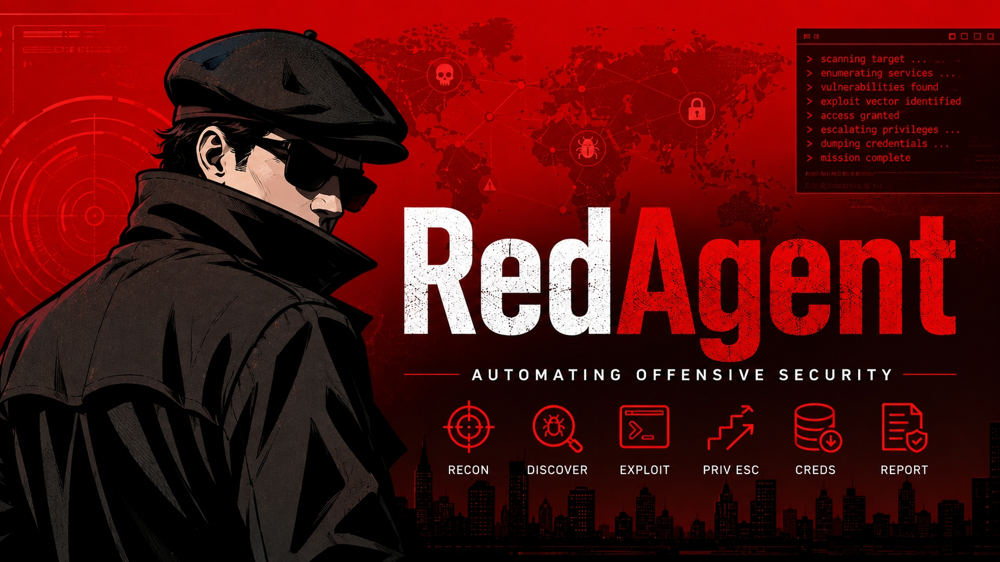

  

## RedAgent: Under active development

RedAgent brings real offensive firepower to authorized security teams - adversary-grade testing across web, API, cloud, identity, and detection surfaces, aimed with precision and held under complete control.

Every operation runs inside hard authorization boundaries: scoped to the targets you are cleared to engage, policy-gated, fully audited, and evidenced from first probe to final report, with results driven straight from finding to remediation. Supervised AI accelerates the expert work without ever letting force outrun authorization. RedAgent is built to strike as hard as a real adversary - and to stop exactly where it is told. Powerful firepower, controlled, and only ever within authorized scope.

## Disclaimer

RedAgent is pre-release, dual-use offensive security software, provided on an "AS IS" and "AS AVAILABLE" basis, without warranty or condition of any kind, whether express, implied, or statutory, including but not limited to merchantability, fitness for a particular purpose, title, non-infringement, accuracy, reliability, or availability, and without any guarantee that the software will be uninterrupted, timely, secure, or error-free. It may change, regress, break, or contain defects at any time.

### Authorized use only

- Use RedAgent only for lawful, authorized security testing.
- Obtain explicit, documented authorization in advance for every target, and assess only systems, networks, accounts, data, and assets you own or are expressly permitted to test.
- Comply with all applicable laws, regulations, contracts, and policies, including computer-misuse, anti-hacking, privacy, data-protection, and export-control laws.
- Do not use RedAgent for any unauthorized, unlawful, harmful, or malicious purpose. It must not be used to access, disrupt, or attack systems you are not cleared to engage.

### You are solely responsible for

- API keys / admin tokens: creation, storage, rotation, and revocation.
- Runtime configuration: environment variables, config files, and UI settings.
- Network exposure: tunnels, reverse proxies, and public endpoints.
- Data handling: logs, prompts, outputs, and any content generated, stored, or transmitted.
- Authorization and scope: obtaining, recording, and honoring permission for every target and action.
- Operational safety: containment, cleanup, and preventing collateral or third-party impact.

### Key handling guidance (all environments)

- Prefer environment variables for API keys and admin tokens.
- UI key storage, if enabled, is for local, single-user setups only.
- Never commit secrets or embed them in versioned files.
- Rotate tokens regularly and immediately after any suspected exposure.

### Common deployment contexts (you must secure each)

- Local / single-user: treat keys as secrets; avoid long-term browser storage.
- LAN / shared machines: require admin tokens, restrict source IPs, and disable unsafe endpoints.
- Public / tunneled / reverse-proxy: enforce strict allowlists, HTTPS, and least-privilege access.
- Desktop / portable / scripts: ensure secrets are not logged or persisted by launchers or wrappers.

### No liability

To the maximum extent permitted by applicable law, the authors, developers, maintainers, and contributors accept no responsibility or liability for:

- Unauthorized access to, or misuse of, your instance, keys, tokens, or data.
- Any unauthorized, unlawful, unethical, negligent, or malicious use of the software, by you or by any third party.
- Loss of data, keys, credentials, or generated content.
- Damage to, or compromise of, any system, network, service, or third party.
- Any direct, indirect, incidental, special, exemplary, punitive, or consequential damages, or loss of profits, revenue, goodwill, or business, arising out of or connected with the use of, inability to use, or reliance on the software or its output, whether in contract, tort (including negligence), strict liability, or otherwise, and whether or not advised of the possibility of such damages.

### Assumption of risk and indemnification

- You assume all risk arising from your use of RedAgent and are solely liable for your use and its consequences.
- To the maximum extent permitted by law, you agree to defend, indemnify, and hold harmless the authors, maintainers, and contributors from and against any and all claims, demands, actions, investigations, liabilities, damages, losses, fines, penalties, and costs (including reasonable legal fees) arising out of or related to your use or misuse of the software, your violation of any law or third-party right, or your breach of these terms.
- Providing, contributing to, or maintaining this project creates no partnership, agency, duty of care, warranty, or liability toward any user or third party. Each contributor's work is provided on the same "AS IS", no-liability basis.
- If any provision of this disclaimer is held unenforceable, the remaining provisions remain in full force.

### Acceptance

By downloading, installing, running, using, or contributing to this project, you acknowledge that you have read, understood, and agree to these terms. If you do not agree, do not use the software.

## License

RedAgent is released under the MIT License. See the [LICENSE](LICENSE) file for the full text.
